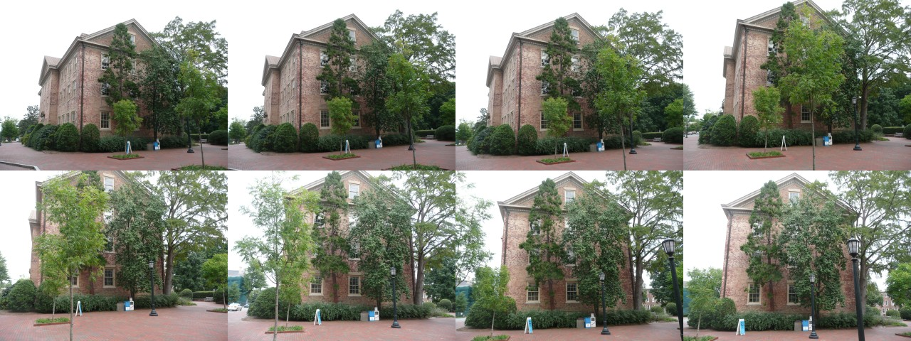
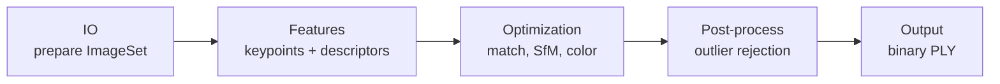

# luthier

**Photogrammetry from photographs to 3D point clouds.**

[](https://github.com/alexandrelheinen/luthier/actions/workflows/ci.yml)
[](https://www.python.org/)
[](https://github.com/psf/black)
[](LICENSE)

luthier is a photogrammetry project shipped as two faces of one engine:

- a **Python library** (`import luthier`) for embedding reconstruction in your
  own pipelines, and
- a **command-line client** (`luthier …`) for running reconstruction from a
  shell.

Both reconstruct a **colored 3D point cloud** from a folder of overlapping
images.

> **Project status — v0.3.0 (M1):** sparse Structure-from-Motion reconstruction
> from a local image directory to a colored binary PLY is **implemented**
> (pycolmap + Open3D post-processing). Install with
> `pip install -e ".[dev,reconstruction]"`.

| Document | Description |
| --- | --- |
| [docs/specification.md](docs/specification.md) | Product spec and acceptance criteria (SDD) |
| [docs/decisions.md](docs/decisions.md) | Resolved architecture decisions (Step 1 / M1) |
| [docs/architecture.md](docs/architecture.md) | System design, **algorithm stack** (§9), module layout |
| [docs/algorithms.md](docs/algorithms.md) | Algorithm choices, pros/cons, OSS libraries per layer |
| [docs/testing.md](docs/testing.md) | TDD strategy and test traceability |
| [docs/m1-demo.md](docs/m1-demo.md) | **M1 visual demo** (golden dataset → PLY, images, video) |
| [CONTRIBUTING.md](CONTRIBUTING.md) | Development workflow and quality gates |

---

## What it does

```text
  photos/                                          scene.ply
 ┌──────────┐                                    ┌──────────────┐
 │ img1.jpg │                                    │ 3D points    │
 │ img2.jpg │  ──  luthier (photogrammetry)  ──▶ │ + RGB colors │
 │   ...    │                                    └──────┬───────┘
 └──────────┘                                           │
                                                        ▼
                                                  CloudCompare
                                                   (viewer)
```

1. Read images from a **local directory** (`--dir`).
2. Run Structure-from-Motion and related stages via the configured algorithm stack.
3. Write a **binary PLY** point cloud (`--output` or a temporary file).
4. Open the result in an external viewer — **[CloudCompare](https://www.cloudcompare.org/)** is recommended.

**Example output** on the public [COLMAP South Building](https://colmap.github.io/datasets.html)
golden set (20 photos → ~5k colored points):

| Input (sample) | Reconstructed cloud |
| --- | --- |
|  |  |

Full demo page: [docs/m1-demo.md](docs/m1-demo.md) — includes PLY, orbit video, and reproduction steps.

A **second input source** (remote URLs, manifests, etc.) will be added in a
future release without breaking the local workflow.

---

## Algorithm stack (systems view)

Reconstruction is organized in layers from **N images** to a **binary PLY**.
Full contracts (inputs, outputs, formats) are in
[docs/architecture.md §9](docs/architecture.md#9-algorithm-stack).



| Layer | Role |
| --- | --- |
| **IO** | Discover, validate, decode images; sync golden data; *(future)* video → frames |
| **Features** | Keypoints, descriptors, regions of interest |
| **Optimization** | Correspondences, camera poses, triangulation, **per-point RGB** |
| **Post-processing** | Reject geometric outliers; optional color refinement |
| **Output** | Serialize `PointCloud` → `.ply` (CloudCompare-ready) |

**Web UI:** belongs in the **Interface** layer (with CLI/API), not IO — it would
call the same `pipeline` and use IO only for staging uploads. A bundled viewer
remains out of scope per the spec.

---

## Pluggable algorithm stack (design guidelines)

Before M1 implementation, luthier standardizes how algorithms are **named**,
**wired**, and **swapped**. Goal: change a stage by editing `config/stack.yml`,
not by rewriting `pipeline.py`.

### Design pattern: Strategy + Registry + Pipeline

| Pattern | Role in luthier |
| --- | --- |
| [**Strategy**](https://refactoring.guru/design-patterns/strategy) | Each algorithm implements a small **layer protocol** (`protocols/*.py`) with one job (discover, extract, reconstruct, filter, write). |
| [**Registry**](https://martinfowler.com/eaaCatalog/registry.html) | `stack/registry.py` maps the string in `stack.yml` (`algorithm: colmap_sift`) to a factory that builds the Strategy. |
| **Pipeline (application)** | `pipeline.py` loads `StackConfig`, resolves each slot, passes **domain artifacts** layer to layer (`ImageSet` → `FeatureSet` → … → `PointCloud`). |

Only **general structures** are shared across layers:

- **Domain models** — `PointCloud`, `Point3D`, inputs/results (`models.py`); future `ImageSet`, `FeatureSet`, `ReconstructionScene`.
- **Protocols** — `luthier/protocols/` (typing `Protocol` interfaces per layer).
- **Stack config** — `luthier/stack/config.py` + `config/stack.yml`.
- **Exceptions** — `luthier/exceptions.py`.

Algorithm-specific types, third-party handles (pycolmap database paths, OpenCV
matrices), and tuning constants stay **inside** `{algorithm_name}.py`.

### File naming: `{algorithm_name}.py`

Inside each layer package (`io/`, `features/`, `reconstruction/`, `postprocess/`,
`output/`), **one file per algorithm**. The file name must match the `algorithm`
value in `stack.yml` (snake_case):

```text
src/luthier/
  io/
    pathlib_discover.py      # algorithm: pathlib_discover
    opencv_decode.py           # algorithm: opencv_decode
  features/
    colmap_sift.py             # algorithm: colmap_sift
  reconstruction/
    colmap_incremental.py    # algorithm: colmap_incremental
  postprocess/
    statistical_outlier_removal.py
  output/
    ply_binary_le.py           # algorithm: ply_binary_le
```

Rules:

1. **No generic names** (`extraction.py`, `utils.py`) for algorithm code — use the algorithm id.
2. **Thin compatibility shims** are allowed (`io/images.py` re-exporting `pathlib_discover`) for public API stability.
3. **Register** each implementation in `stack/registry.py` (or the layer `__init__.py` during import) under its `algorithm` string.
4. **Parameters** tune behavior via `params:` in YAML, not hard-coded constants in `pipeline.py`.

### Stack configuration (`config/stack.yml`)

The stack file selects implementations per **layer** and **slot**:

```yaml
layers:
  features:
    extractor:
      algorithm: colmap_sift
      params:
        max_num_features: 8192
```

- `algorithm: null` — skip optional slot (e.g. dense MVS in M1).
- `params` — passed to the registered factory; validated by the algorithm module.

Default file: [`config/stack.yml`](config/stack.yml) (`m1-sparse-colmap-default`).

Load in Python:

```python
from pathlib import Path

from luthier.stack import load_stack_config

stack = load_stack_config(Path("config/stack.yml"))
print(stack.slot("features", "extractor").algorithm)  # colmap_sift
```

CLI with a custom stack:

```bash
luthier --dir ./photos --stack config/stack.yml --output scene.ply
```

To swap features to a future backend, change one line:

```yaml
    extractor:
      algorithm: superpoint  # after implementing features/superpoint.py
```

Further detail: [docs/architecture.md §10](docs/architecture.md#10-config-driven-algorithm-stack).

---

## Installation

Requires **Python 3.12** (see `.python-version`).

```bash
python3.12 -m venv .venv
source .venv/bin/activate   # Windows: .venv\Scripts\activate
pip install -e ".[dev,reconstruction]"
```

For a runtime-only install from PyPI (reconstruction included):

```bash
pip install "luthier[reconstruction]"
```

After installation the `luthier` command is available on your `PATH`.

---

## Command-line usage

### Basic reconstruction (local directory)

```bash
luthier --dir /path/to/photos --output /path/to/scene.ply
```

Optional custom algorithm stack:

```bash
luthier --dir ./photos --stack config/stack.yml --output scene.ply
```

### Omit output path (temporary file)

When `--output` is not given, luthier creates a temporary `.ply` file and prints
its absolute path on **stdout** when reconstruction succeeds:

```bash
luthier --dir ./photos
# /tmp/luthier-abc123.ply   (printed on success)
```

The temporary file is **not** deleted automatically so you can inspect it.

### Help and version

```bash
luthier --help
luthier --version
python -m luthier --help
```

### Exit codes

| Code | Meaning |
| --- | --- |
| `0` | Success |
| `1` | Invalid input or reconstruction error |
| `2` | Reserved for unimplemented pipeline stages |

---

## Python API

```python
from pathlib import Path

from luthier import reconstruct_from_directory

result = reconstruct_from_directory(
    Path("/data/photos"),
    output_path=Path("/data/out/scene.ply"),
)

print(f"Wrote {result.point_cloud.count} points to {result.output_path}")
```

### Discover images only

```python
from pathlib import Path

from luthier.io import discover_images

paths = discover_images(Path("/data/photos"))
print(f"Found {len(paths)} images")
```

---

## Input requirements (`--dir`)

| Rule | Detail |
| --- | --- |
| Path | Must exist and be a directory |
| Layout | Images must sit **directly** in the folder (no subfolders in v0.2.0) |
| Formats | `.jpg`, `.jpeg`, `.png`, `.tif`, `.tiff`, `.bmp` (case-insensitive) |
| Overlap | Photos should overlap substantially (typical photogrammetry practice) |
| Minimum count | ≥ 2 for reconstruction (≥ 10 for acceptance / golden tests) |

---

## Output format: binary PLY

luthier writes **binary little-endian PLY** with colored vertices:

| Property | Type |
| --- | --- |
| `x`, `y`, `z` | `float32` |
| `red`, `green`, `blue` | `uint8` (0–255) |

Default file extension: **`.ply`**

Full on-disk layout is defined in [docs/specification.md](docs/specification.md#5-output-specification--point-cloud-format).

---

## Viewing the point cloud

luthier does not include a viewer. Use open-source tools:

### Recommended: CloudCompare

- Website: [https://www.cloudcompare.org/](https://www.cloudcompare.org/)
- License: GPL-2.0
- Why: native PLY support, fast rendering, measurement and comparison tools

```bash
# Example (Linux, if installed)
cloudcompare.CloudCompare /path/to/scene.ply
```

Or open **File → Open** in the CloudCompare GUI.

### Alternatives

| Tool | Command / action |
| --- | --- |
| [MeshLab](https://www.meshlab.net/) | File → Import Mesh |
| [Open3D](https://www.open3d.org/) | `open3d draw scene.ply` |
| [ParaView](https://www.paraview.org/) | File → Open |

---

## Project layout

```text
src/luthier/
  cli.py              # luthier --dir … --output …
  pipeline.py         # orchestration (loads stack.yml)
  models.py           # shared domain types
  protocols/          # layer interfaces (Strategy contracts)
    observability.py  # ProgressReporter (cross-cutting)
    cache.py          # ArtifactCache (cross-cutting)
  stack/
    config.py         # load stack.yml
    registry.py       # algorithm name → implementation
    bootstrap.py      # register built-ins + discover plugins
  io/
    pathlib_discover.py
    opencv_decode.py
    images.py         # API shim → pathlib_discover
  features/
    colmap_sift.py
  reconstruction/
    colmap_incremental.py
  postprocess/
    statistical_outlier_removal.py
  output/
    ply_binary_le.py
config/
  stack.yml           # default algorithm stack (edit to swap backends)
docs/
  specification.md    # SDD product specification
  architecture.md     # System design + algorithm stack (§9)
  algorithms.md       # Algorithm & library research (state of the art)
  testing.md          # TDD / V-cycle testing strategy
tests/
  test_cli.py
  test_models.py
  test_images.py
  test_pointcloud.py
  test_pipeline.py
  test_acceptance.py
```

---

## Development

Install dev dependencies and run the same checks as CI:

```bash
pip install -e ".[dev]"
black src tests
ruff check src tests
mypy
pytest --cov=luthier --cov-report=term-missing
python scripts/check_governance.py   # method-enforcement gate (see CONTRIBUTING)
```

CI enforces **≥ 80%** line coverage on `luthier` (`fail_under` in `pyproject.toml`)
and runs a **governance** job (requirement traceability, stack/code consistency,
Conventional commits) — see
[CONTRIBUTING.md § Method enforcement](CONTRIBUTING.md#method-enforcement-cicd).

See [CONTRIBUTING.md](CONTRIBUTING.md) for SDD → V-cycle → TDD workflow and
unitary commit rules.

### Running tests

```bash
# Default (excludes acceptance tests needing golden images)
pytest

# Fetch COLMAP golden images, then run acceptance tests
./scripts/fetch_golden_colmap.sh
pytest -m acceptance

# Regenerate committed documentation assets (docs/assets/m1-demo/)
python scripts/generate_m1_doc_artifacts.py
```

---

## Roadmap

| Milestone | Status |
| --- | --- |
| v0.3.0 — Spec, CLI framework, tests | **Shipped** |
| M1 — Sparse SfM → PLY | **Current** |
| M2 — Denser point cloud | Planned |
| M3 — Second input source | Planned |

---

## License

MIT — see [LICENSE](LICENSE).
