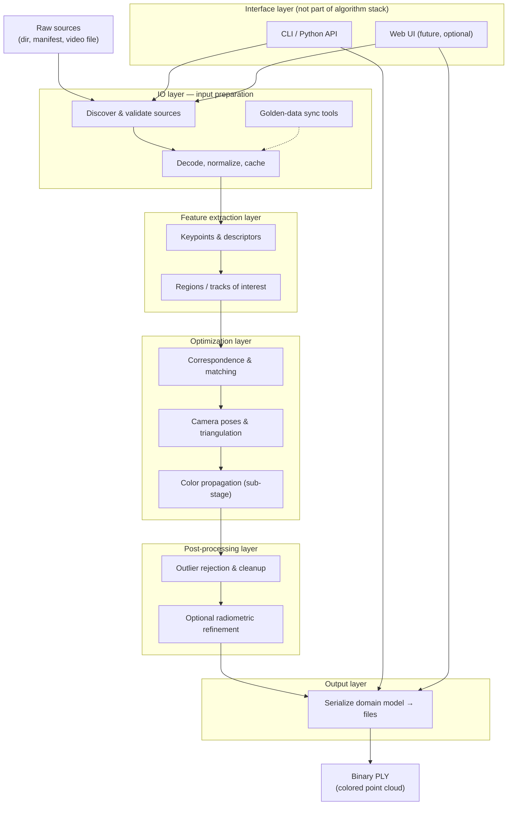

# Luthier — system architecture

This document is the **spec-anchored** system and module design for luthier. It
implements the left side of the V-cycle (system design + architecture) for
[specification.md](specification.md).

---

## 1. System context

```text
┌─────────────────────────────────────────────────────────────────┐
│                         Operator / Developer                     │
└───────────────┬───────────────────────────────┬─────────────────┘
                │ CLI: luthier --dir …          │ Python API
                ▼                               ▼
┌───────────────────────────┐       ┌───────────────────────────┐
│      luthier.cli          │       │   luthier.pipeline        │
│  argparse, exit codes       │──────▶│ reconstruct_from_directory│
└───────────────────────────┘       └─────────────┬─────────────┘
                                                  │
                    ┌─────────────────────────────┼─────────────────────────────┐
                    ▼                             ▼                             ▼
           ┌──────────────┐              ┌──────────────┐              ┌──────────────┐
           │ luthier.io   │              │  (future)    │              │ luthier.io   │
           │ .images      │              │  sfm / match │              │ .pointcloud  │
           │ discover     │              │  stages      │              │ write PLY    │
           └──────────────┘              └──────────────┘              └──────────────┘
                    │                             │                             │
                    └─────────────────────────────┴─────────────────────────────┘
                                                  │
                                                  ▼
                                        ┌──────────────────┐
                                        │  scene.ply       │
                                        │  (binary PLY)    │
                                        └────────┬─────────┘
                                                 │
                                                 ▼
                                        ┌──────────────────┐
                                        │  CloudCompare      │
                                        │  (external viewer) │
                                        └──────────────────┘
```

---

## 2. Layering

Two orthogonal views apply:

1. **Software layers** (who calls whom) — table below.
2. **Algorithm stack** (what happens to the data) — [§9 Algorithm stack](#9-algorithm-stack).

| Layer | Modules | Responsibility |
| --- | --- | --- |
| **Interface** | `cli`, `__main__`, *(future `web`)* | Argument parsing, stdout/stderr, exit codes; optional HTTP UI |
| **Application** | `pipeline` | Orchestrate reconstruction end-to-end |
| **Domain** | `models`, `exceptions` | Typed data and error taxonomy |
| **Algorithm** | `io`, `features`, `reconstruction`, `postprocess`, `output` | See §9 — input prep through serialization |
| **Adapters** | `reconstruction.colmap` (M1) | Wrap **pycolmap**; map errors to `ReconstructionError` |

Algorithm stages (feature extraction, matching, SfM, coloring, outlier rejection)
are **logical sub-stages** inside the Algorithm layers; M1 may delegate several
of them to pycolmap while keeping the §9 contracts stable for tests and future
backends.

---

## 2.1 Third-party blocks (M1)

See [decisions.md](decisions.md) AD-03. Summary:

```text
discover_images          pycolmap incremental_mapping      write_point_cloud
     (stdlib)      →         (SfM backend)            →         (stdlib struct)
  io.images            reconstruction.colmap              output / io.pointcloud
```

| Block | Library | luthier wrapper |
| --- | --- | --- |
| Image paths | stdlib | `io.images.discover_images` |
| Sparse SfM | pycolmap | `reconstruction.colmap.run_sparse_reconstruction` (planned) |
| PLY export | stdlib `struct` | `output.serialize.write_point_cloud` (via `io.pointcloud` during transition) |
| Arrays | numpy | Convert pycolmap output → `PointCloud` |

---

## 3. Module reference

### 3.1 `luthier.cli`

- Builds `argparse` parser (`build_parser`).
- Validates `--dir` presence and path (`validate_args`).
- Resolves output path or temp file (`resolve_output_path`).
- Maps exceptions to exit codes (`run`, `main`).

### 3.2 `luthier.pipeline`

- Single entry: `reconstruct_from_directory(image_dir, *, output_path)`.
- Validates `LocalImageInput`, runs stages, calls `write_point_cloud`.
- Returns `ReconstructionResult`.

### 3.3 `luthier.io.images`

- `discover_images(image_dir) -> tuple[Path, ...]`.
- `SUPPORTED_IMAGE_SUFFIXES` constant.

### 3.4 `luthier.io.pointcloud`

- `write_point_cloud(point_cloud, output_path, *, file_format="ply")`.
- `POINT_CLOUD_FORMAT_PLY`, `DEFAULT_POINT_CLOUD_FORMAT`.

### 3.5 `luthier.models`

| Type | Fields |
| --- | --- |
| `Point3D` | `x, y, z, r, g, b` |
| `PointCloud` | `points: tuple[Point3D, ...]` |
| `LocalImageInput` | `image_dir: Path` |
| `ReconstructionResult` | `point_cloud`, `output_path`, `source` |

### 3.6 `luthier.exceptions`

Hierarchy:

```text
LuthierError
├── InvalidInputError
├── ReconstructionError
└── NotImplementedPipelineError
```

---

## 4. Data flow (local input)

1. **CLI** parses `--dir` and optional `--output`.
2. **pipeline** constructs `LocalImageInput`.
3. **io.images** discovers image paths.
4. **(future)** SfM builds `PointCloud`.
5. **io.pointcloud** writes binary PLY to `output_path`.
6. **CLI** prints `output_path` on success.

---

## 5. Extension points (second input source)

Add a new input model (e.g. `RemoteImageInput`) and a registry or strategy in
`pipeline` without changing PLY output or CLI exit codes. CLI might gain `--url`
or `--manifest`; Python API might gain `reconstruct_from_manifest(...)`.

Keep **one** internal representation: `tuple[Path, ...]` of local paths (download
remote sources to a cache directory first).

---

## 6. Failure modes

| Condition | API | CLI |
| --- | --- | --- |
| Missing `--dir` | N/A | `LuthierError`, exit 1 |
| Bad directory | `ValueError` / `InvalidInputError` | exit 1 |
| No images | `InvalidInputError` | exit 1 |
| Pipeline failure | `ReconstructionError` | exit 1 |
| Not implemented | `NotImplementedPipelineError` | exit 2 |

---

## 7. Packaging and entry points

| Entry | Mechanism |
| --- | --- |
| `luthier` command | `[project.scripts]` → `luthier.cli:main` |
| `python -m luthier` | `luthier/__main__.py` |

---

## 8. Module tree (M1 target)

See [§9.5](#95-module-tree-algorithm-stack-target) for the full algorithm-stack
layout. Minimal M1 slice:

```text
src/luthier/
  __init__.py
  __main__.py
  cli.py
  pipeline.py
  models.py
  exceptions.py
  io/
    __init__.py
    images.py
    sync.py              # placeholder
    video.py             # placeholder
    pointcloud.py        # transitions to output/ in §9
  features/              # placeholder package
  reconstruction/        # M1 adapter (replaces sfm/)
    colmap.py
  postprocess/           # placeholder package
  output/                # placeholder package
```

Each new package requires updates to this document, `specification.md`, and
[testing.md](testing.md) before implementation.

---

## 9. Algorithm stack

This section defines the **reconstruction pipeline** as a stack of layers from
**N input images** to a **colored 3D point cloud** in the on-disk format defined
in [specification.md](specification.md#5-output-specification--point-cloud-format).

The description is **systems-oriented**: each layer specifies what it consumes,
what it produces, and the characteristics of those artifacts. **Which algorithm**
performs each step (SIFT, COLMAP incremental mapping, statistical outlier removal,
etc.) is an implementation choice inside the layer, not part of this contract.
See [algorithms.md](algorithms.md) for the state-of-the-art catalog of options.

### 9.1 Stack overview



**End-to-end path (local directory, M1 target):**

```text
N images on disk
  → IO: discover, validate, decode → ImageSet
  → Features: keypoints + descriptors → FeatureSet
  → Optimization: match, SfM, triangulate, assign color → ReconstructionScene
  → Post-processing: reject outliers → PointCloud
  → Output: write binary PLY → scene.ply
```

The **application layer** (`pipeline`) orchestrates these stages in order and
maps failures to the domain exception taxonomy (§3.6).

### 9.2 Where the web interface belongs

A **web interface** (upload form, job status, download link) is **not** part of
the IO layer. It belongs in the **Interface layer**, alongside `cli` and the
Python API:

| Concern | Layer | Rationale |
| --- | --- | --- |
| Uploading files, showing progress, serving downloads | **Interface** | Presentation and transport; same role as argparse |
| Validating paths, decoding pixels, caching to local disk | **IO** | Data preparation independent of how the user invoked luthier |
| Running reconstruction | **Application + algorithm stack** | Shared by CLI, API, and web |

A future web server would call the same `pipeline` entry points as the CLI. The
IO layer may gain helpers the web UI uses (e.g. writing uploads to a staging
directory), but **orchestration and HTTP** stay outside IO.

Per [specification.md](specification.md#23-out-of-scope-v020), a bundled web
viewer remains **out of scope**; an optional **web front-end for running
reconstruction** is a separate Interface concern and does not change layer
contracts below.

### 9.3 Layer contracts

#### 9.3.1 IO layer — input preparation

**Package (target):** `luthier.io` (+ `luthier.io.sync`, `luthier.io.video` future)

**Responsibility:** Turn external **raw sources** into a normalized, local
**ImageSet** ready for computer-vision stages. Includes operational tools
(syncing golden datasets, manifest resolution, staging remote assets) that are
not part of the core reconstruction math.

| | Specification |
| --- | --- |
| **Inputs** | • Local directory path (`--dir`)<br>• Future: manifest URL/path, object-store references, video file path<br>• Optional sync metadata (golden dataset name, cache root) |
| **Input format** | • Raster files: `.jpg`, `.jpeg`, `.png`, `.tif`, `.tiff`, `.bmp` (case-insensitive)<br>• Non-recursive directory layout (v0.2.0)<br>• Future video: container formats TBD (e.g. `.mp4`) |
| **Outputs** | **`ImageSet`** — ordered collection of **`PreparedImage`** records |
| **Output characteristics** | • Each `PreparedImage`: stable `id`, absolute `path`, width, height, optional EXIF/camera hints<br>• Decoded pixel arrays accessible to downstream layers (in-memory or memory-mapped)<br>• `count ≥ 2` required before optimization (≥ 10 for golden acceptance tests)<br>• All paths local and readable; remote sources materialized under a cache directory first |
| **Errors** | `InvalidInputError` — missing dir, no images, unreadable file, unsupported format |
| **Tools (non-pipeline)** | `discover_images`, golden sync (`scripts/fetch_golden_colmap.sh` → future `io.sync`), cache management |

**Not in IO:** feature detection, matching, PLY writing, HTTP routing.

---

#### 9.3.2 Feature extraction layer

**Package (target):** `luthier.features`

**Responsibility:** Extract **salient structure** from each prepared image —
keypoints, descriptors, and optional regions of interest — so that
correspondences can be found across views. Designed to extend toward **video**
(frame sampling → per-frame features) and **challenging viewpoints** (low angle,
wide baseline) without changing upstream IO or downstream optimization contracts.

| | Specification |
| --- | --- |
| **Inputs** | **`ImageSet`** from IO layer |
| **Input characteristics** | • `N ≥ 2` images<br>• Consistent channel layout (RGB or grayscale; documented per run)<br>• Optional: frame index and timestamp when sourced from video |
| **Outputs** | **`FeatureSet`** |
| **Output characteristics** | • Per image: list of **keypoints** `(x, y)` in pixel coordinates, **descriptor** vectors (fixed dimension per extractor config)<br>• Optional: **regions of interest** masks or bounding boxes<br>• Stable **feature ids** within an image; global **track ids** may be assigned later in optimization<br>• Metadata: extractor name/version, detection threshold |
| **Errors** | `ReconstructionError` — extractor failure, insufficient features in one or more images |
| **Future extensions** | Video: sliding-window frame selection → many `PreparedImage` entries; robust detectors for low POV / motion blur |

**Not in this layer:** pairwise matching, 3D coordinates, file export.

---

#### 9.3.3 Optimization layer

**Package (target):** `luthier.reconstruction` (adapter: `luthier.reconstruction.colmap` for M1)

**Responsibility:** The **core photogrammetric solve** — establish correspondences
across images, estimate camera poses and intrinsics, triangulate 3D points, and
**assign per-point color**. This is the largest and most configurable layer;
implementation may delegate to pycolmap/COLMAP while preserving the contracts here.

| | Specification |
| --- | --- |
| **Inputs** | **`FeatureSet`**<br>• Optional: **`ImageSet`** (required for color propagation — pixel access) |
| **Input characteristics** | • Overlapping views (sufficient common features between pairs)<br>• Descriptors comparable under chosen matcher |
| **Outputs** | **`ReconstructionScene`** (internal; not written to disk directly) |
| **Output characteristics** | • **Cameras:** pose + intrinsics per registered image<br>• **Points:** 3D position `(x, y, z)` in a consistent world frame<br>• **Color:** RGB `(r, g, b)` per point, `uint8` per channel<br>• **Observations:** mapping from points to image features (for debugging / dense stages)<br>• `count ≥ 1` registered images and `count ≥ 1` triangulated points for success |
| **Errors** | `ReconstructionError` — matching failure, degenerate geometry, SfM did not register |

**Sub-stages (logical, same layer):**

```text
FeatureSet → correspondence / matching → incremental or global SfM
          → bundle adjustment → triangulation → color propagation
          → ReconstructionScene
```

##### Color assignment — placement decision

**Per-point color is assigned in the Optimization layer**, as the final sub-stage
**color propagation**, not in a separate top-level layer for M1.

| Approach | Layer | When |
| --- | --- | --- |
| **Color propagation** (project 3D point into source images, sample pixel RGB, aggregate e.g. median or best-view) | **Optimization** | **M1 default** — simple, standard in SfM; pycolmap/COLMAP provide this |
| **Radiometric refinement** (exposure compensation, vignetting) | **Post-processing** (optional) | When multi-image color inconsistency is visible |
| **Dense MVS coloring** | **Optimization** (M2 extension) | Denser cloud from stereo patches |
| **Dedicated color / appearance layer** | New layer only if needed | Deferred — e.g. learned appearance models or relighting; not required for sparse PLY |

Rationale: color is **derived from known geometry and camera poses** plus source
pixels. It does not require a separate sophisticated algorithm stack for the
first milestone; it is a deterministic function of the reconstruction result.
Post-processing may **refine** colors but does not **define** them.

---

#### 9.3.4 Post-processing layer

**Package (target):** `luthier.postprocess`

**Responsibility:** Improve **quality and usability** of the reconstructed cloud
after the numerical solve — primarily **geometric outlier rejection**, with
optional color consistency passes. Does not re-estimate camera poses.

| | Specification |
| --- | --- |
| **Inputs** | **`ReconstructionScene`** or domain **`PointCloud`** converted from it |
| **Input characteristics** | • Points with `(x, y, z)` and `(r, g, b)`<br>• Optional observation graph for statistical filters |
| **Outputs** | **`PointCloud`** (domain model, [specification.md](specification.md)) |
| **Output characteristics** | • Same coordinate frame as input scene<br>• Subset of points (count ≤ input count)<br>• RGB preserved or refined; channels remain `uint8` in `[0, 255]`<br>• No NaN/Inf coordinates |
| **Errors** | `ReconstructionError` — filter removed all points (degenerate result) |
| **Typical operations** | Statistical radius outlier removal, duplicate merging, optional radiometric refinement |

**Not in this layer:** PLY bytes on disk, image discovery, bundle adjustment.

---

#### 9.3.5 Output layer

**Package (target):** `luthier.output` (serialization; `luthier.io.pointcloud` re-exports during transition)

**Responsibility:** Serialize the domain **`PointCloud`** to **consumer-ready
files**. Pure formatting — no change to geometric or color meaning except
encoding (e.g. float32 → disk layout).

| | Specification |
| --- | --- |
| **Inputs** | **`PointCloud`** (`Point3D` tuples with `x, y, z, r, g, b`) |
| **Input characteristics** | • `count ≥ 1`<br>• Valid color channels per `Point3D` validation |
| **Outputs** | Files on disk at caller-provided `output_path` |
| **Output format (M1)** | **Binary little-endian PLY** — see [specification.md §5](specification.md#5-output-specification--point-cloud-format):<br>• Vertex properties: `x, y, z` (`float32`), `red, green, blue` (`uint8`)<br>• Default extension `.ply` |
| **Output characteristics** | • File exists and is readable by CloudCompare<br>• Point count in header matches records written<br>• Future (M4): LAZ, PCD — same `PointCloud` input, different serializers |
| **Errors** | `LuthierError` — unwritable path, unsupported `file_format` |
| **Return value** | `ReconstructionResult` (application layer) includes `point_cloud`, `output_path`, `source` |

**Distinction from IO:** IO prepares **inputs** from the outside world; Output
writes **results** for downstream tools. Symmetric file concerns, opposite
direction in the pipeline.

---

### 9.4 Cross-layer data glossary

| Artifact | Produced by | Consumed by | Notes |
| --- | --- | --- | --- |
| `ImageSet` | IO | Features, Optimization (color) | Local, validated images |
| `PreparedImage` | IO | Features | Single image + metadata |
| `FeatureSet` | Features | Optimization | Keypoints + descriptors |
| `ReconstructionScene` | Optimization | Post-processing | Poses + colored 3D points + observations |
| `PointCloud` | Post-processing | Output | Public domain type in `models.py` |
| `ReconstructionResult` | Application | Interface | Metadata after successful run |

Types marked *future* may start as `TypedDict`, dataclasses, or adapter-specific
structs; only **`PointCloud`** and **`ReconstructionResult`** are public API
today ([specification.md §7](specification.md#7-python-api)).

### 9.5 Module tree (algorithm stack target)

Placeholders exist under `src/luthier/` for the long-term layout. M1 may
implement only a subset (IO images, `reconstruction.colmap` adapter, output PLY).

```text
src/luthier/
  pipeline.py                 # orchestrates layers 9.3.1 → 9.3.5
  models.py                   # PointCloud, Point3D, inputs, results
  io/
    images.py                 # discover_images (implemented)
    sync.py                   # golden / remote cache sync (placeholder)
    video.py                  # video → frame ImageSet (placeholder)
  features/
    extraction.py             # FeatureSet production (placeholder)
  reconstruction/
    colmap.py                 # pycolmap adapter (placeholder)
    coloring.py               # color propagation contract (placeholder)
  postprocess/
    outliers.py               # outlier rejection (placeholder)
  output/
    serialize.py              # PLY and future formats (placeholder; see io.pointcloud)
  sfm/                        # deprecated path name — use reconstruction/ (M1)
```

### 9.6 Interface vs algorithm stack (summary)

```text
┌─────────────────────────────────────────────────────────────┐
│ Interface: cli, __main__, (future web/)                      │
│   • parse args / HTTP • exit codes • progress messages       │
└────────────────────────────┬────────────────────────────────┘
                             │ calls
┌────────────────────────────▼────────────────────────────────┐
│ Application: pipeline.reconstruct_from_directory             │
└────────────────────────────┬────────────────────────────────┘
                             │
     ┌───────────────────────┼───────────────────────┐
     ▼                       ▼                       ▼
  IO layer              Feature layer          (returns)
     │                       │                       │
     └───────────┬───────────┘                       │
                 ▼                                   │
         Optimization layer                           │
                 │                                   │
                 ▼                                   │
         Post-processing layer                       │
                 │                                   │
                 ▼                                   │
           Output layer ─────────────────────────────┘
```

Each new package requires updates to this section, `specification.md`, and
[testing.md](testing.md) before implementation.
