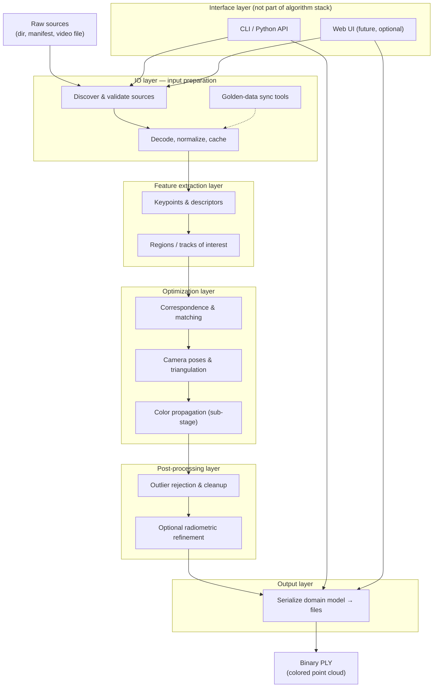

# Luthier — system architecture

This document is the **spec-anchored** system and module design for luthier. It
implements the left side of the V-cycle (system design + architecture) for
[specification.md](specification.md).

---

## 1. System context

```text
┌─────────────────────────────────────────────────────────────────┐
│                         Operator / Developer                     │
└───────────────┬───────────────────────────────┬─────────────────┘
                │ CLI: luthier --dir …          │ Python API
                ▼                               ▼
┌───────────────────────────┐       ┌───────────────────────────┐
│      luthier.cli          │       │   luthier.pipeline        │
│  argparse, exit codes       │──────▶│ reconstruct_from_directory│
└───────────────────────────┘       └─────────────┬─────────────┘
                                                  │
                    ┌─────────────────────────────┼─────────────────────────────┐
                    ▼                             ▼                             ▼
           ┌──────────────┐              ┌──────────────┐              ┌──────────────┐
           │ luthier.io   │              │  (future)    │              │ luthier.io   │
           │ .images      │              │  sfm / match │              │ .pointcloud  │
           │ discover     │              │  stages      │              │ write PLY    │
           └──────────────┘              └──────────────┘              └──────────────┘
                    │                             │                             │
                    └─────────────────────────────┴─────────────────────────────┘
                                                  │
                                                  ▼
                                        ┌──────────────────┐
                                        │  scene.ply       │
                                        │  (binary PLY)    │
                                        └────────┬─────────┘
                                                 │
                                                 ▼
                                        ┌──────────────────┐
                                        │  CloudCompare      │
                                        │  (external viewer) │
                                        └──────────────────┘
```

---

## 2. Layering

Two orthogonal views apply:

1. **Software layers** (who calls whom) — table below.
2. **Algorithm stack** (what happens to the data) — [§9 Algorithm stack](#9-algorithm-stack).

| Layer | Modules | Responsibility |
| --- | --- | --- |
| **Interface** | `cli`, `__main__`, *(future `web`, `api`)* | Argument parsing, stdout/stderr, exit codes; optional HTTP UI |
| **Application** | `pipeline` | Orchestrate reconstruction end-to-end |
| **Domain** | `models`, `exceptions` | Typed data and error taxonomy |
| **Algorithm** | `io`, `features`, `reconstruction`, `postprocess`, `output` | See §9 — input prep through serialization |
| **Adapters** | `reconstruction.colmap` (M1) | Wrap **pycolmap**; map errors to `ReconstructionError` |
| **Cross-cutting** | `protocols.observability`, `protocols.cache`, `stack` (registry/bootstrap) | Concerns that span all layers: progress/telemetry, artifact caching, algorithm discovery — see [§11 Scalability](#11-scalability-and-extensibility) |

Algorithm stages (feature extraction, matching, SfM, coloring, outlier rejection)
are **logical sub-stages** inside the Algorithm layers; M1 may delegate several
of them to pycolmap while keeping the §9 contracts stable for tests and future
backends.

**Cross-cutting layer:** observability, caching, and plugin discovery are
deliberately *not* pipeline stages — they are orthogonal concerns injected into
every stage. Treating them as a stage would couple unrelated responsibilities
and break the Strategy boundary. See §11 for the scalability rationale.

---

## 2.1 Third-party blocks (M1)

See [decisions.md](decisions.md) AD-03. Summary:

```text
discover_images          pycolmap incremental_mapping      write_point_cloud
     (stdlib)      →         (SfM backend)            →         (stdlib struct)
  io.images            reconstruction.colmap              output / io.pointcloud
```

| Block | Library | luthier wrapper |
| --- | --- | --- |
| Image paths | stdlib | `io.images.discover_images` |
| Sparse SfM | pycolmap | `reconstruction.colmap.run_sparse_reconstruction` (planned) |
| PLY export | stdlib `struct` | `output.serialize.write_point_cloud` (via `io.pointcloud` during transition) |
| Arrays | numpy | Convert pycolmap output → `PointCloud` |

---

## 3. Module reference

### 3.1 `luthier.cli`

- Builds `argparse` parser (`build_parser`).
- Validates `--dir` presence and path (`validate_args`).
- Resolves output path or temp file (`resolve_output_path`).
- Maps exceptions to exit codes (`run`, `main`).

### 3.2 `luthier.pipeline`

- Single entry: `reconstruct_from_directory(image_dir, *, output_path)`.
- Validates `LocalImageInput`, runs stages, calls `write_point_cloud`.
- Returns `ReconstructionResult`.

### 3.3 `luthier.io.images`

- `discover_images(image_dir) -> tuple[Path, ...]`.
- `SUPPORTED_IMAGE_SUFFIXES` constant.

### 3.4 `luthier.io.pointcloud`

- `write_point_cloud(point_cloud, output_path, *, file_format="ply")`.
- `POINT_CLOUD_FORMAT_PLY`, `DEFAULT_POINT_CLOUD_FORMAT`.

### 3.5 `luthier.models`

| Type | Fields |
| --- | --- |
| `Point3D` | `x, y, z, r, g, b` |
| `PointCloud` | `points: tuple[Point3D, ...]` |
| `LocalImageInput` | `image_dir: Path` |
| `ReconstructionResult` | `point_cloud`, `output_path`, `source` |

### 3.6 `luthier.exceptions`

Hierarchy:

```text
LuthierError
├── InvalidInputError
├── ReconstructionError
└── NotImplementedPipelineError
```

---

## 4. Data flow (local input)

1. **CLI** parses `--dir` and optional `--output`.
2. **pipeline** constructs `LocalImageInput`.
3. **io.images** discovers image paths.
4. **(future)** SfM builds `PointCloud`.
5. **io.pointcloud** writes binary PLY to `output_path`.
6. **CLI** prints `output_path` on success.

---

## 5. Extension points (second input source)

Add a new input model (e.g. `RemoteImageInput`) and a registry or strategy in
`pipeline` without changing PLY output or CLI exit codes. CLI might gain `--url`
or `--manifest`; Python API might gain `reconstruct_from_manifest(...)`.

Keep **one** internal representation: `tuple[Path, ...]` of local paths (download
remote sources to a cache directory first).

---

## 6. Failure modes

| Condition | API | CLI |
| --- | --- | --- |
| Missing `--dir` | N/A | `LuthierError`, exit 1 |
| Bad directory | `ValueError` / `InvalidInputError` | exit 1 |
| No images | `InvalidInputError` | exit 1 |
| Pipeline failure | `ReconstructionError` | exit 1 |
| Not implemented | `NotImplementedPipelineError` | exit 2 |

---

## 7. Packaging and entry points

| Entry | Mechanism |
| --- | --- |
| `luthier` command | `[project.scripts]` → `luthier.cli:main` |
| `python -m luthier` | `luthier/__main__.py` |

---

## 8. Module tree (M1 target)

See [§9.5](#95-module-tree-algorithm-stack-target) for the full algorithm-stack
layout. Minimal M1 slice:

```text
src/luthier/
  __init__.py
  __main__.py
  cli.py
  pipeline.py
  models.py
  exceptions.py
  io/
    __init__.py
    images.py
    sync.py              # placeholder
    video.py             # placeholder
    pointcloud.py        # transitions to output/ in §9
  features/              # placeholder package
  reconstruction/        # M1 adapter (replaces sfm/)
    colmap.py
  postprocess/           # placeholder package
  output/                # placeholder package
```

Each new package requires updates to this document, `specification.md`, and
[testing.md](testing.md) before implementation.

---

## 9. Algorithm stack

This section defines the **reconstruction pipeline** as a stack of layers from
**N input images** to a **colored 3D point cloud** in the on-disk format defined
in [specification.md](specification.md#5-output-specification--point-cloud-format).

The description is **systems-oriented**: each layer specifies what it consumes,
what it produces, and the characteristics of those artifacts. **Which algorithm**
performs each step (SIFT, COLMAP incremental mapping, statistical outlier removal,
etc.) is an implementation choice inside the layer, not part of this contract.
See [algorithms.md](algorithms.md) for the state-of-the-art catalog of options.

### 9.1 Stack overview



**End-to-end path (local directory, M1 target):**

```text
N images on disk
  → IO: discover, validate, decode → ImageSet
  → Features: keypoints + descriptors → FeatureSet
  → Optimization: match, SfM, triangulate, assign color → ReconstructionScene
  → Post-processing: reject outliers → PointCloud
  → Output: write binary PLY → scene.ply
```

The **application layer** (`pipeline`) orchestrates these stages in order and
maps failures to the domain exception taxonomy (§3.6).

### 9.2 Where the web interface belongs

A **web interface** (upload form, job status, download link) is **not** part of
the IO layer. It belongs in the **Interface layer**, alongside `cli` and the
Python API:

| Concern | Layer | Rationale |
| --- | --- | --- |
| Uploading files, showing progress, serving downloads | **Interface** | Presentation and transport; same role as argparse |
| Validating paths, decoding pixels, caching to local disk | **IO** | Data preparation independent of how the user invoked luthier |
| Running reconstruction | **Application + algorithm stack** | Shared by CLI, API, and web |

A future web server would call the same `pipeline` entry points as the CLI. The
IO layer may gain helpers the web UI uses (e.g. writing uploads to a staging
directory), but **orchestration and HTTP** stay outside IO.

Per [specification.md](specification.md#23-out-of-scope-v020), a bundled web
viewer remains **out of scope**; an optional **web front-end for running
reconstruction** is a separate Interface concern and does not change layer
contracts below.

### 9.3 Layer contracts

#### 9.3.1 IO layer — input preparation

**Package (target):** `luthier.io` (+ `luthier.io.sync`, `luthier.io.video` future)

**Responsibility:** Turn external **raw sources** into a normalized, local
**ImageSet** ready for computer-vision stages. Includes operational tools
(syncing golden datasets, manifest resolution, staging remote assets) that are
not part of the core reconstruction math.

| | Specification |
| --- | --- |
| **Inputs** | • Local directory path (`--dir`)<br>• Future: manifest URL/path, object-store references, video file path<br>• Optional sync metadata (golden dataset name, cache root) |
| **Input format** | • Raster files: `.jpg`, `.jpeg`, `.png`, `.tif`, `.tiff`, `.bmp` (case-insensitive)<br>• Non-recursive directory layout (v0.2.0)<br>• Future video: container formats TBD (e.g. `.mp4`) |
| **Outputs** | **`ImageSet`** — ordered collection of **`PreparedImage`** records |
| **Output characteristics** | • Each `PreparedImage`: stable `id`, absolute `path`, width, height, optional EXIF/camera hints<br>• Decoded pixel arrays accessible to downstream layers (in-memory or memory-mapped)<br>• `count ≥ 2` required before optimization (≥ 10 for golden acceptance tests)<br>• All paths local and readable; remote sources materialized under a cache directory first |
| **Errors** | `InvalidInputError` — missing dir, no images, unreadable file, unsupported format |
| **Tools (non-pipeline)** | `discover_images`, golden sync (`scripts/fetch_golden_colmap.sh` → future `io.sync`), cache management |

**Not in IO:** feature detection, matching, PLY writing, HTTP routing.

---

#### 9.3.2 Feature extraction layer

**Package (target):** `luthier.features`

**Responsibility:** Extract **salient structure** from each prepared image —
keypoints, descriptors, and optional regions of interest — so that
correspondences can be found across views. Designed to extend toward **video**
(frame sampling → per-frame features) and **challenging viewpoints** (low angle,
wide baseline) without changing upstream IO or downstream optimization contracts.

| | Specification |
| --- | --- |
| **Inputs** | **`ImageSet`** from IO layer |
| **Input characteristics** | • `N ≥ 2` images<br>• Consistent channel layout (RGB or grayscale; documented per run)<br>• Optional: frame index and timestamp when sourced from video |
| **Outputs** | **`FeatureSet`** |
| **Output characteristics** | • Per image: list of **keypoints** `(x, y)` in pixel coordinates, **descriptor** vectors (fixed dimension per extractor config)<br>• Optional: **regions of interest** masks or bounding boxes<br>• Stable **feature ids** within an image; global **track ids** may be assigned later in optimization<br>• Metadata: extractor name/version, detection threshold |
| **Errors** | `ReconstructionError` — extractor failure, insufficient features in one or more images |
| **Future extensions** | Video: sliding-window frame selection → many `PreparedImage` entries; robust detectors for low POV / motion blur |

**Not in this layer:** pairwise matching, 3D coordinates, file export.

---

#### 9.3.3 Optimization layer

**Package (target):** `luthier.reconstruction` (adapter: `luthier.reconstruction.colmap` for M1)

**Responsibility:** The **core photogrammetric solve** — establish correspondences
across images, estimate camera poses and intrinsics, triangulate 3D points, and
**assign per-point color**. This is the largest and most configurable layer;
implementation may delegate to pycolmap/COLMAP while preserving the contracts here.

| | Specification |
| --- | --- |
| **Inputs** | **`FeatureSet`**<br>• Optional: **`ImageSet`** (required for color propagation — pixel access) |
| **Input characteristics** | • Overlapping views (sufficient common features between pairs)<br>• Descriptors comparable under chosen matcher |
| **Outputs** | **`ReconstructionScene`** (internal; not written to disk directly) |
| **Output characteristics** | • **Cameras:** pose + intrinsics per registered image<br>• **Points:** 3D position `(x, y, z)` in a consistent world frame<br>• **Color:** RGB `(r, g, b)` per point, `uint8` per channel<br>• **Observations:** mapping from points to image features (for debugging / dense stages)<br>• `count ≥ 1` registered images and `count ≥ 1` triangulated points for success |
| **Errors** | `ReconstructionError` — matching failure, degenerate geometry, SfM did not register |

**Sub-stages (logical, same layer):**

```text
FeatureSet → correspondence / matching → incremental or global SfM
          → bundle adjustment → triangulation → color propagation
          → ReconstructionScene
```

##### Color assignment — placement decision

**Per-point color is assigned in the Optimization layer**, as the final sub-stage
**color propagation**, not in a separate top-level layer for M1.

| Approach | Layer | When |
| --- | --- | --- |
| **Color propagation** (project 3D point into source images, sample pixel RGB, aggregate e.g. median or best-view) | **Optimization** | **M1 default** — simple, standard in SfM; pycolmap/COLMAP provide this |
| **Radiometric refinement** (exposure compensation, vignetting) | **Post-processing** (optional) | When multi-image color inconsistency is visible |
| **Dense MVS coloring** | **Optimization** (M2 extension) | Denser cloud from stereo patches |
| **Dedicated color / appearance layer** | New layer only if needed | Deferred — e.g. learned appearance models or relighting; not required for sparse PLY |

Rationale: color is **derived from known geometry and camera poses** plus source
pixels. It does not require a separate sophisticated algorithm stack for the
first milestone; it is a deterministic function of the reconstruction result.
Post-processing may **refine** colors but does not **define** them.

---

#### 9.3.4 Post-processing layer

**Package (target):** `luthier.postprocess`

**Responsibility:** Improve **quality and usability** of the reconstructed cloud
after the numerical solve — primarily **geometric outlier rejection**, with
optional color consistency passes. Does not re-estimate camera poses.

| | Specification |
| --- | --- |
| **Inputs** | **`ReconstructionScene`** or domain **`PointCloud`** converted from it |
| **Input characteristics** | • Points with `(x, y, z)` and `(r, g, b)`<br>• Optional observation graph for statistical filters |
| **Outputs** | **`PointCloud`** (domain model, [specification.md](specification.md)) |
| **Output characteristics** | • Same coordinate frame as input scene<br>• Subset of points (count ≤ input count)<br>• RGB preserved or refined; channels remain `uint8` in `[0, 255]`<br>• No NaN/Inf coordinates |
| **Errors** | `ReconstructionError` — filter removed all points (degenerate result) |
| **Typical operations** | Statistical radius outlier removal, duplicate merging, optional radiometric refinement |

**Not in this layer:** PLY bytes on disk, image discovery, bundle adjustment.

---

#### 9.3.5 Output layer

**Package (target):** `luthier.output` (serialization; `luthier.io.pointcloud` re-exports during transition)

**Responsibility:** Serialize the domain **`PointCloud`** to **consumer-ready
files**. Pure formatting — no change to geometric or color meaning except
encoding (e.g. float32 → disk layout).

| | Specification |
| --- | --- |
| **Inputs** | **`PointCloud`** (`Point3D` tuples with `x, y, z, r, g, b`) |
| **Input characteristics** | • `count ≥ 1`<br>• Valid color channels per `Point3D` validation |
| **Outputs** | Files on disk at caller-provided `output_path` |
| **Output format (M1)** | **Binary little-endian PLY** — see [specification.md §5](specification.md#5-output-specification--point-cloud-format):<br>• Vertex properties: `x, y, z` (`float32`), `red, green, blue` (`uint8`)<br>• Default extension `.ply` |
| **Output characteristics** | • File exists and is readable by CloudCompare<br>• Point count in header matches records written<br>• Future (M4): LAZ, PCD — same `PointCloud` input, different serializers |
| **Errors** | `LuthierError` — unwritable path, unsupported `file_format` |
| **Return value** | `ReconstructionResult` (application layer) includes `point_cloud`, `output_path`, `source` |

**Distinction from IO:** IO prepares **inputs** from the outside world; Output
writes **results** for downstream tools. Symmetric file concerns, opposite
direction in the pipeline.

---

### 9.4 Cross-layer data glossary

| Artifact | Produced by | Consumed by | Notes |
| --- | --- | --- | --- |
| `ImageSet` | IO | Features, Optimization (color) | Local, validated images |
| `PreparedImage` | IO | Features | Single image + metadata |
| `FeatureSet` | Features | Optimization | Keypoints + descriptors |
| `ReconstructionScene` | Optimization | Post-processing | Poses + colored 3D points + observations |
| `PointCloud` | Post-processing | Output | Public domain type in `models.py` |
| `ReconstructionResult` | Application | Interface | Metadata after successful run |

Types marked *future* may start as `TypedDict`, dataclasses, or adapter-specific
structs; only **`PointCloud`** and **`ReconstructionResult`** are public API
today ([specification.md §7](specification.md#7-python-api)).

### 9.5 Module tree (algorithm stack target)

Placeholders exist under `src/luthier/` for the long-term layout. M1 may
implement only a subset (IO images, `reconstruction.colmap` adapter, output PLY).

```text
src/luthier/
  pipeline.py                 # orchestrates layers 9.3.1 → 9.3.5
  models.py                   # PointCloud, Point3D, inputs, results
  io/
    images.py                 # discover_images (implemented)
    sync.py                   # golden / remote cache sync (placeholder)
    video.py                  # video → frame ImageSet (placeholder)
  features/
    extraction.py             # FeatureSet production (placeholder)
  reconstruction/
    colmap.py                 # pycolmap adapter (placeholder)
    coloring.py               # color propagation contract (placeholder)
  postprocess/
    outliers.py               # outlier rejection (placeholder)
  output/
    serialize.py              # PLY and future formats (placeholder; see io.pointcloud)
  sfm/                        # deprecated path name — use reconstruction/ (M1)
```

### 9.6 Interface vs algorithm stack (summary)

```text
┌─────────────────────────────────────────────────────────────┐
│ Interface: cli, __main__, (future web/)                      │
│   • parse args / HTTP • exit codes • progress messages       │
└────────────────────────────┬────────────────────────────────┘
                             │ calls
┌────────────────────────────▼────────────────────────────────┐
│ Application: pipeline.reconstruct_from_directory             │
└────────────────────────────┬────────────────────────────────┘
                             │
     ┌───────────────────────┼───────────────────────┐
     ▼                       ▼                       ▼
  IO layer              Feature layer          (returns)
     │                       │                       │
     └───────────┬───────────┘                       │
                 ▼                                   │
         Optimization layer                           │
                 │                                   │
                 ▼                                   │
         Post-processing layer                       │
                 │                                   │
                 ▼                                   │
           Output layer ─────────────────────────────┘
```

Each new package requires updates to this section, `specification.md`, and
[testing.md](testing.md) before implementation.

---

## 10. Config-driven algorithm stack

This section defines **how** algorithms are plugged into the layers from
[§9](#9-algorithm-stack). Algorithm **choices** are cataloged in
[algorithms.md](algorithms.md); defaults live in [`config/stack.yml`](../config/stack.yml).

### 10.1 Pattern: Strategy + Registry + Pipeline

```text
config/stack.yml
       │
       ▼
 load_stack_config()  ──▶  StackConfig (layer → slot → algorithm + params)
       │
       ▼
 pipeline.py  ──for each slot──▶  registry.resolve(layer, slot)
       │                              │
       │                              ▼
       │                    {algorithm_name}.py  (Strategy)
       │
       └── passes only domain artifacts between layers
```

| Piece | Module | Responsibility |
| --- | --- | --- |
| **Protocols** | `luthier/protocols/` | `typing.Protocol` per layer; stable `run`/`discover`/`extract`/… signatures |
| **Algorithms** | `luthier/{layer}/{algorithm_name}.py` | One Strategy per file; name matches YAML `algorithm:` |
| **Registry** | `luthier/stack/registry.py` | `register(layer, algorithm, factory)`; `resolve` for pipeline |
| **Config** | `luthier/stack/config.py` | Parse and validate `stack.yml` → `StackConfig` |
| **Pipeline** | `luthier/pipeline.py` | Load config, resolve slots in order, no algorithm names hard-coded |

**Shared vs algorithm-local**

| Shared (cross-layer) | Algorithm-local (inside `{algorithm_name}.py`) |
| --- | --- |
| `PointCloud`, `Point3D`, `ReconstructionResult` | pycolmap `Database`, reconstruction objects |
| Future: `ImageSet`, `FeatureSet`, `ReconstructionScene` | OpenCV `Mat`, SIFT detector instances |
| `StackConfig`, `SlotConfig` | Default thresholds not exposed in YAML |
| Protocol interfaces | Backend-specific error translation to `ReconstructionError` |

### 10.2 `stack.yml` schema

| Field | Type | Required | Description |
| --- | --- | --- | --- |
| `version` | int | yes | Config schema version (currently `1`) |
| `name` | str | yes | Preset identifier (e.g. `m1-sparse-colmap-default`) |
| `description` | str | no | Human-readable summary |
| `layers` | map | yes | Top-level keys: `io`, `features`, `reconstruction`, `postprocess`, `output` |
| `layers.*.*` | slot | yes | Nested slot name (e.g. `extractor`, `sfm`, `serializer`) |
| `algorithm` | str \| null | yes | Registered algorithm id, or `null` to skip optional stage |
| `params` | map | no | Keyword arguments for the algorithm factory |

**Slot catalog (M1 target)**

| Layer | Slot | Default `algorithm` |
| --- | --- | --- |
| `io` | `discover` | `pathlib_discover` |
| `io` | `decode` | `opencv_decode` |
| `io` | `video_frames` | `null` |
| `features` | `extractor` | `colmap_sift` |
| `reconstruction` | `pair_selection` | `colmap_exhaustive_pairs` |
| `reconstruction` | `matcher` | `colmap_exhaustive_match` |
| `reconstruction` | `verifier` | `colmap_ransac` |
| `reconstruction` | `sfm` | `colmap_incremental` |
| `reconstruction` | `bundle_adjustment` | `colmap_bundle_adjustment` |
| `reconstruction` | `triangulation` | `colmap_triangulation` |
| `reconstruction` | `coloring` | `colmap_median_rgb` |
| `reconstruction` | `dense` | `null` (M2) |
| `postprocess` | `geometric_filter` | `colmap_reprojection_filter` |
| `postprocess` | `outliers` | `statistical_outlier_removal` |
| `postprocess` | `radiometry` | `null` |
| `output` | `serializer` | `ply_binary_le` |

Sub-stages under `reconstruction` may be implemented by a **single** backend
(`colmap_incremental` wrapping pycolmap) that reads all reconstruction slots;
finer slots still allow future decomposition without YAML churn.

### 10.3 Adding a new algorithm

1. Create `src/luthier/{layer}/{algorithm_name}.py` implementing the layer protocol.
2. Call `register("{layer}", "{algorithm_name}", factory)` with a factory accepting `SlotConfig`.
3. Document the algorithm in [algorithms.md](algorithms.md).
4. Add or switch an entry in `config/stack.yml`.
5. Add unit tests for the module and an integration test with the stack preset.

### 10.4 Module tree (config-aware)

```text
config/
  stack.yml
src/luthier/
  protocols/
  stack/
  io/pathlib_discover.py
  features/colmap_sift.py
  reconstruction/colmap_incremental.py
  postprocess/statistical_outlier_removal.py
  output/ply_binary_le.py
```

See also [README § Pluggable algorithm stack](../README.md#pluggable-algorithm-stack-design-guidelines).

---

## 11. Scalability and extensibility

This section is a **critical review** of whether the §2 layering and the §10
config-driven stack scale along the axes luthier must grow on, and it specifies
the additional **interfaces** required to close the gaps. It is the spec-anchored
input for the cross-cutting scaffolding (see [decisions.md](decisions.md)
AD-09 … AD-12).

### 11.1 Scaling axes — assessment

| Axis | Current design | Verdict | Gap to close |
| --- | --- | --- | --- |
| **More images per run** (10 → 10⁴) | Stages pass whole artifacts in memory; no caching or resume | ⚠️ Limited | Artifact cache + streaming-friendly artifacts (§11.4) |
| **More algorithms / backends** | Strategy + Registry + `{algorithm_name}.py` | ✅ Good shape | Registry is **never populated** at runtime; needs discovery (§11.2) |
| **More clients** (CLI → web, API, batch) | `pipeline.reconstruct_from_directory` only | ⚠️ Partial | Stable application-service entry + progress contract (§11.3) |
| **Long-running / observable runs** | No progress, logging, or telemetry contract | ❌ Missing | `ProgressReporter` interface (§11.3) |
| **Resumable / distributed runs** | No intermediate persistence | ❌ Missing | `ArtifactCache` interface (§11.4) |
| **Third-party plugins** | No extension entry point | ❌ Missing | `importlib.metadata` entry points (§11.2) |

The **Strategy/Registry/Pipeline** pattern is the right backbone; the missing
pieces are **cross-cutting interfaces**, not new pipeline stages. Adding them as
stages would violate the single-responsibility boundary of §9.

### 11.2 Algorithm registration and discovery (new interface)

**Problem.** §10 defines a registry, but no code imports the
`{algorithm_name}.py` modules, so `registry.resolve(...)` would find an **empty**
registry at runtime. The scaffolding looks pluggable but is not yet wired. This
blocks every other layer.

**Design.** Two complementary mechanisms, both feeding `stack/registry.py`:

| Mechanism | For | How |
| --- | --- | --- |
| **Built-in bootstrap** | luthier's own modules | `stack.bootstrap.load_builtin_algorithms()` imports each layer's modules and registers them under their `name`. Idempotent; called once by the pipeline. |
| **Entry-point discovery** | third-party plugins | `stack.bootstrap.load_plugins()` reads `importlib.metadata.entry_points(group="luthier.algorithms")`; each plugin registers its strategies on import. |

```text
pipeline.run()
  └─ stack.bootstrap.load_algorithms()      # builtins + plugins, once
        ├─ load_builtin_algorithms()        # import luthier.{layer}.{name}
        └─ load_plugins()                   # entry_points("luthier.algorithms")
  └─ for slot in stack: registry.resolve(layer, slot)   # now non-empty
```

A registered module is a **Strategy**: a module exposing `name` plus the layer
protocol method (`discover` / `decode` / `extract` / `reconstruct` / `filter` /
`write`) structurally satisfies the corresponding `protocols/` interface
(`runtime_checkable`).

### 11.3 Observability (new interface)

**Problem.** SfM runs take minutes to hours; a web client and CI need progress
and timing, but the pipeline has no contract for emitting them. Printing to
stdout (CLI) is an Interface concern and must not leak into the Algorithm layers.

**Design.** A `ProgressReporter` protocol in `protocols/observability.py`, passed
*into* the pipeline by the Interface layer:

| Method | Purpose |
| --- | --- |
| `start(stage, total=None)` | A stage begins (e.g. `features`, with image count) |
| `advance(stage, n=1)` | Units of work completed |
| `event(stage, message, **fields)` | Structured log / telemetry point |
| `finish(stage)` | A stage completed |

The default is a **no-op** reporter (zero overhead, keeps the API unchanged for
library users). The CLI supplies a console reporter; a web server supplies one
that pushes to a job-status channel. Algorithm modules receive the reporter via
the factory `SlotConfig`/run context, never importing the CLI.

### 11.4 Artifact cache (new interface)

**Problem.** Re-running after a failed late stage recomputes features and matches
from scratch; large runs cannot fit all artifacts in memory or resume. There is
no place to persist `FeatureSet`, the match graph, or the sparse model.

**Design.** An `ArtifactCache` protocol in `protocols/cache.py`:

| Method | Purpose |
| --- | --- |
| `key(stage, inputs)` | Deterministic content key for a stage's output |
| `get(key)` | Return a cached artifact or `None` |
| `put(key, artifact)` | Persist an artifact |

The default is a **null cache** (always misses; preserves current behavior). A
filesystem cache (per-run working directory) enables resume; a shared/object-store
cache enables distributed workers. Caching is opt-in per stage and never changes
results — only whether they are recomputed.

### 11.5 Richer run result (extension, not break)

`ReconstructionResult` (§3.5) carries only `point_cloud`, `output_path`,
`source`. For integration and regression gates at scale it should be extensible
with an optional **run report** (per-stage timings, registered-image count,
mean reprojection error, points before/after filtering). This is additive: new
optional fields, no change to existing consumers. Tracked as a future field;
not required for M1 PLY output.

### 11.6 Module tree (with cross-cutting scaffolding)

```text
src/luthier/
  protocols/
    io.py  features.py  reconstruction.py  postprocess.py  output.py
    observability.py          # ProgressReporter (§11.3)
    cache.py                  # ArtifactCache (§11.4)
  stack/
    config.py  registry.py
    bootstrap.py              # load_builtin_algorithms / load_plugins (§11.2)
  io/ … features/ … reconstruction/ … postprocess/ … output/   # §9 stages
```

### 11.7 Decisions

| Concern | Decision | Ref |
| --- | --- | --- |
| Plugin registration & discovery | Built-in bootstrap + entry-point group `luthier.algorithms` | AD-09 |
| Observability | `ProgressReporter` protocol; no-op default; injected by Interface | AD-10 |
| Artifact cache | `ArtifactCache` protocol; null default; opt-in per stage | AD-11 |
| Run report | Additive optional fields on `ReconstructionResult` | AD-12 |

Each new package or interface here requires updates to this document,
`specification.md`, and [testing.md](testing.md) before implementation, per §8.
